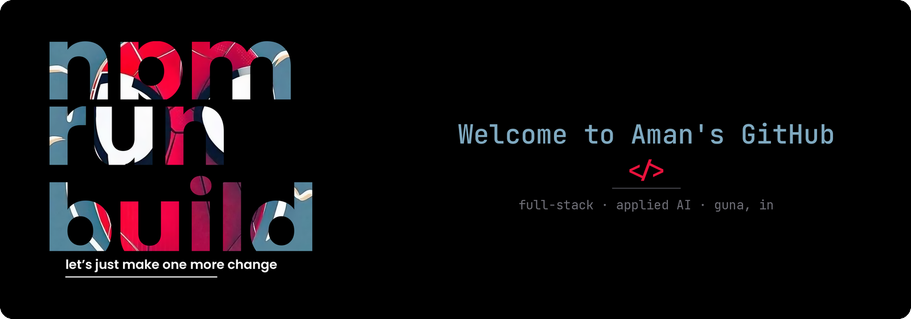

a<!-- ═══════════════════════════ BANNER ═══════════════════════════ -->

  

  

<!-- ═══════════════════════════ LINKS ═══════════════════════════ -->

  
  
  
  

<!-- ═══════════════════════════ TECH ═══════════════════════════ -->
<h2 align="center">🕸️ <i>Technologies</i></h2>

  
  
  
  
  
  
  
   
  
  
  
  
  
   
  
  
  
  
  
   
  
  
  
  
  

<!-- ═══════════════════════════ STATS ═══════════════════════════ -->
<h2 align="center">🕸️ <i>Statistics</i></h2>

  

  
  

<!-- ═══════════════════════════ ABOUT ═══════════════════════════ -->
<h2 align="center">🕸️ <i>About Me</i></h2>

Hey! I'm **Aman Kumar Chhari** — **Tipsy** to most people — a **Full-Stack & Applied AI Engineer** from **Guna, MP** (B.Tech CSE, 2026).

I build systems where **an LLM does the judgment and deterministic code does everything that touches money, stock or state**. Every AI call in my products runs through one gateway: kill switch, daily spend cap, input sanitisation, tool loop — then a human confirms before anything is written.

My main work targets **kirana retail in tier-2 India**: WhatsApp as the interface, Hinglish as the input. The hard part was never the model call. It was making the thing survive real use.

**Open to** Full-Stack / Applied AI / Founding Engineer roles — Gurgaon, Bengaluru or remote. **Available now.**

 

<!-- ═══════════════════════════ PROJECTS ═══════════════════════════ -->
<h2 align="center">🕸️ <i>Featured Builds</i></h2>

<table>
<tr>
<td width="33%" valign="top">

### 🛒 CloseBy
AI-assisted local marketplace. Owners import stock from shelf photos & voice lists — every AI output is a **draft the owner approves**.

- 27 eval cases (Hinglish, unit-less qty, unknown brands)
- Razorpay hold → confirm → auto-refund
- 7-state order machine, geohash search

`Next.js` `Supabase` `Claude` `Razorpay`

[**→ Repo**](https://github.com/chhari07/closeby)

</td>
<td width="33%" valign="top">

### 🔍 ScanCart.ai
Chrome extension running specialist LLM agents over a live listing, fused into one **Trust Score**.

- Parallel fan-out — latency ≈ slowest agent
- Failed agent is **excluded, never guessed**
- Pitched at Rajasthan AI Builders, Jaipur

`Node.js` `Claude` `Chrome MV3` `React`

[**→ Demo**](https://scancartdemo.netlify.app) · [**Repo**](https://github.com/chhari07/scancart.ai)

</td>
<td width="33%" valign="top">

### 💬 Orderly
WhatsApp ordering for kirana shops. Always-on bot answers price & stock from the live catalogue — no app for the buyer.

- Hindi-English messages → priced cart
- Confirmation card before any charge
- Crash supervisor + auto-reconnect

`React` `Supabase` `Node.js` `BuilderBot`

</td>
</tr>
</table>

<!-- ═══════════════════════════ PRINCIPLES ═══════════════════════════ -->
<h2 align="center">🕸️ <i>How I Build</i></h2>

  
  
   
  
  
  

<!-- ═══════════════════════════ GOALS ═══════════════════════════ -->
<h2 align="center">🕸️ <i>Hobbies & Goals</i></h2>

  Freelancing since 2023 · shipping agentic products for real shops, not demos. 
  <i>"It works on my machine" is a bug report, not a status.</i>

<b>🛠️ Always shipping 🕸️</b>

<!-- ═══════════════════════════ FOOTER ═══════════════════════════ -->

  

