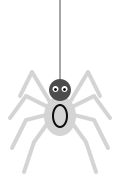

  
  
  

<h2 align="center"> <code>$ ls ~/stack</code></h2>

  
  
  
  
  
  
   
  
  
  
  
  
  
   
  
  
  
  
  
   
  
  
  
  
  

<h2 align="center"> <code>$ git log --graph</code></h2>

  

<h2 align="center"> <code>$ whoami</code></h2>

Hello! My name is <b>Aman Kumar Chhari</b> — <b>Tipsy</b> — and I am a <b>Full-Stack &amp; Applied AI Engineer</b> from Guna, MP (B.Tech CSE, 2026). I build systems where an LLM does the judgment and deterministic code does everything that touches money, stock or state. Right now I'm shipping agentic products for kirana shops in tier-2 India using <b>Next.js, TypeScript, Node.js, LangGraph and the Claude API</b>, with WhatsApp as the interface and Hinglish as the input.

<b>Open to</b> Full-Stack / Applied AI / Founding Engineer roles — Gurgaon, Bengaluru or remote.

 

<h2 align="center"> <code>$ ls ~/projects</code></h2>

  
  &nbsp;AI-assisted local marketplace — every AI output is a draft the shop owner approves.

  
  &nbsp;Chrome extension — parallel LLM agents fused into one Trust Score for Indian e-commerce.

  
  &nbsp;WhatsApp ordering for kirana shops — Hinglish messages to a priced, confirmed cart.

<h2 align="center"> <code>$ cat goals.txt</code></h2>

Freelancing since 2023 · shipping for real shops, not demos. 
<i>"AI that drafts. Humans confirm."</i> — <b>how I build</b>.

<b>⚙️ npm run build — let's just make one more change 🕸️</b>

 
