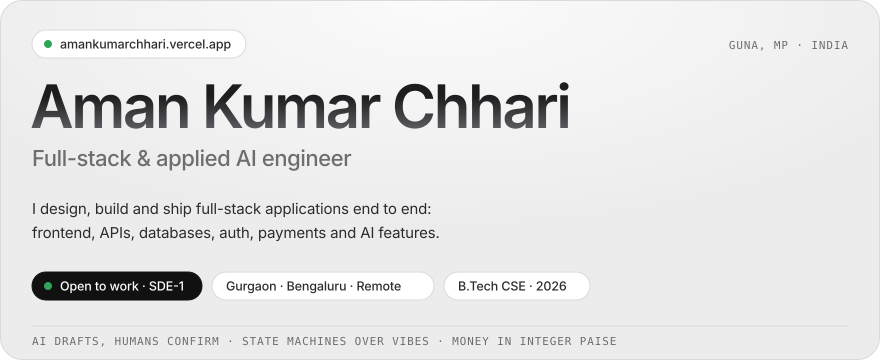
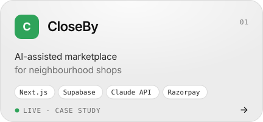
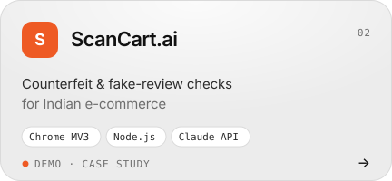
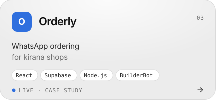
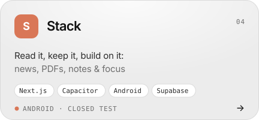
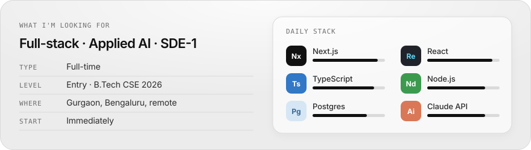
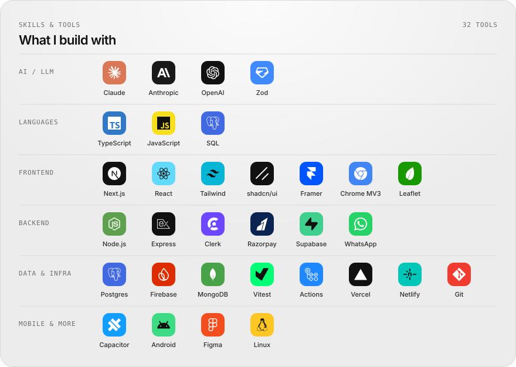

  

  
  
  
  

 

<h3 align="center">Selected work</h3>

  
  
  
  

  <a href="https://closeby-ashy.vercel.app">CloseBy live</a> ·
  <a href="https://github.com/chhari07/closeby">source</a> &nbsp;|&nbsp;
  <a href="https://scancartdemo.netlify.app">ScanCart demo</a> ·
  <a href="https://github.com/chhari07/scancart.ai-">source</a> &nbsp;|&nbsp;
  <a href="https://orderly-blue.vercel.app">Orderly live</a>

 

  

  

  

National Finalist, HackGSon · Semi-Finalist, Smart India Hackathon · Winner, Reimagine Web Dev Hackathon

