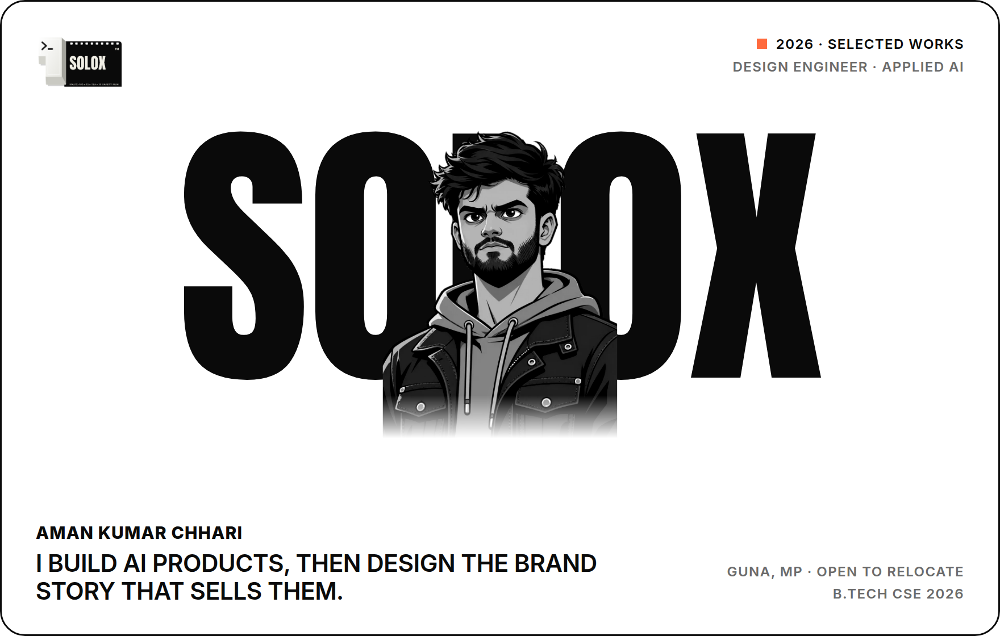
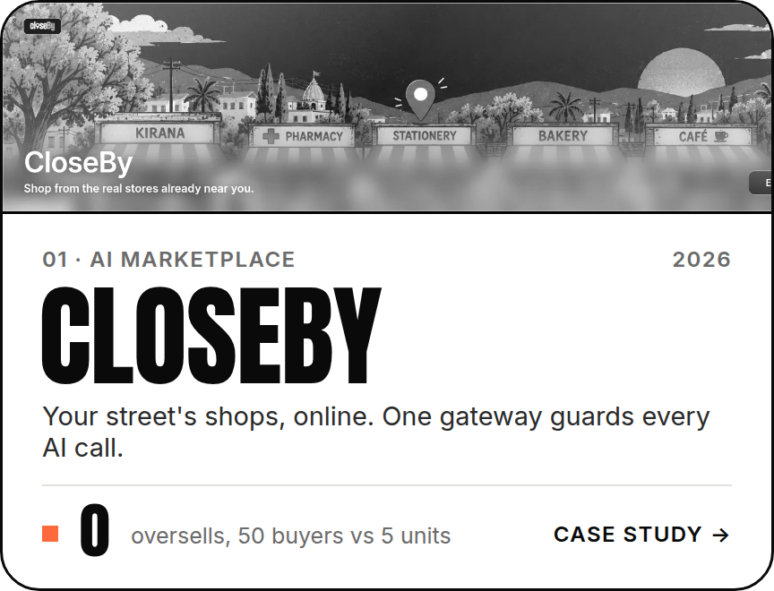
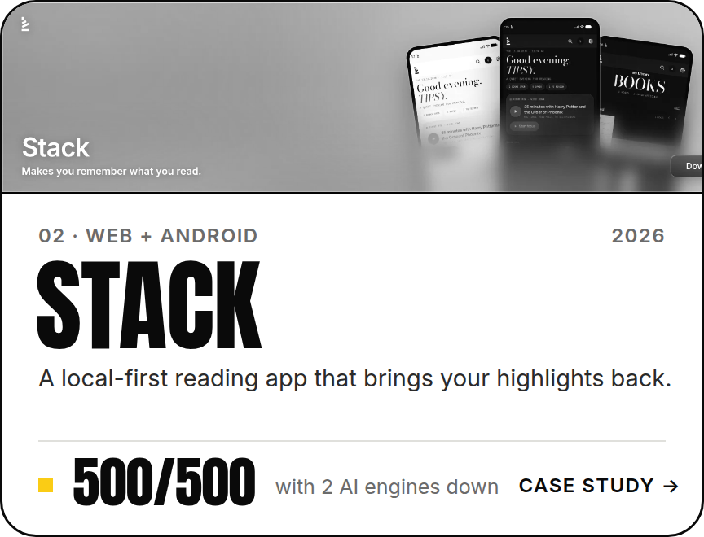
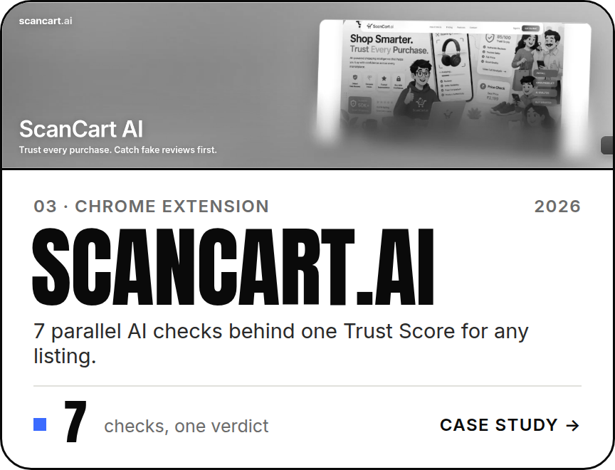
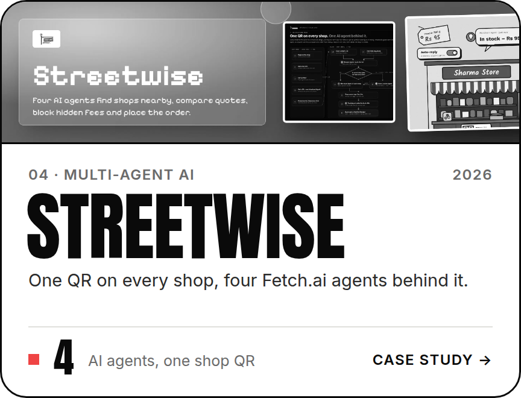
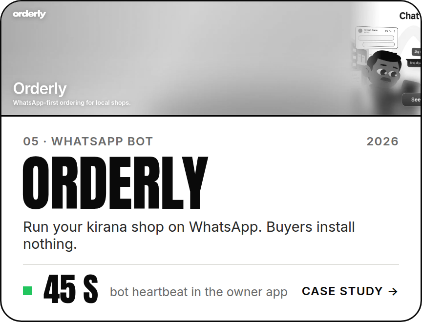
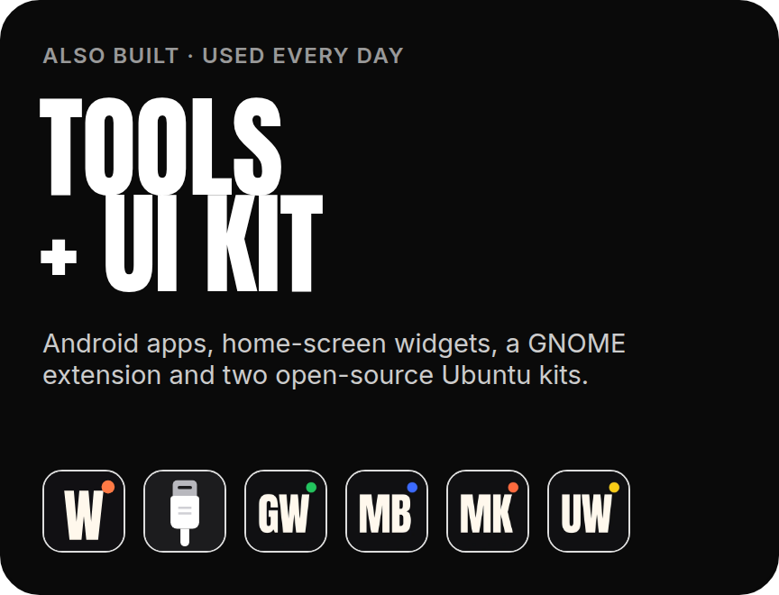
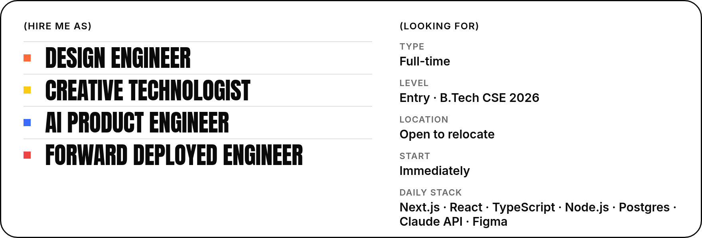
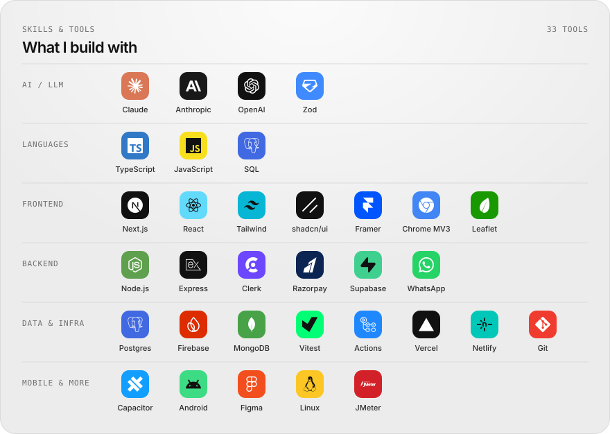

  

  
  
  
  

<b>One person, from the client's problem to the launch poster.</b> 
I ship the AI tool or app with the guardrails that make it safe to run, then turn it into a story people get in 30 seconds: a case study, a poster and an explainer film.

 

<h3 align="center">Selected work</h3>

  
  
  
  
  
  

  <a href="https://closeby-ashy.vercel.app">CloseBy live</a> ·
  <a href="https://github.com/chhari07/closeby">source</a> &nbsp;|&nbsp;
  <a href="https://stack-henna-delta.vercel.app">Stack live</a> ·
  <a href="https://github.com/chhari07/stackforge">source</a> &nbsp;|&nbsp;
  <a href="https://scancartdemo.netlify.app">ScanCart demo</a> ·
  <a href="https://github.com/chhari07/scancart-ai">source</a> &nbsp;|&nbsp;
  <a href="https://github.com/chhari07/streetwise-agents">Streetwise source</a> &nbsp;|&nbsp;
  <a href="https://orderly-blue.vercel.app">Orderly live</a>

  Open source: <a href="https://github.com/chhari07/ubuntu-mac-kit">Ubuntu Mac Kit</a> · <a href="https://github.com/chhari07/ubuntu-widgets">Ubuntu Widgets</a>

 

<h3 align="center">Load-tested with Apache JMeter</h3>

| Project | Test | Result |
|---|---|---|
| [CloseBy](https://amankumarchhari.vercel.app/work/closeby) | 50 buyers race for the last 5 units (×4 runs) | **0 oversells** in 4/4 runs |
| | 100 buyers × 8 orders | **800/800 OK**, ~160 orders/s, 0 stock mismatches |
| | AI spend cap, user over the daily limit | 20/20 blocked, **0 model calls** |
| [ScanCart.ai](https://amankumarchhari.vercel.app/work/scancart) | Parallel fan-out vs sequential | **2.8× faster** (13.7 s → 4.8 s) |
| | 50 concurrent users | **200/200 scans OK**, no latency increase |
| [Stack](https://amankumarchhari.vercel.app/work/stack) | Top two AI engines down | **500/500 served**, p95 1.6 s |
| | 80 simultaneous requests, limit 50 | stopped at **exactly 50** |

Run against local copies with mock LLMs and local Postgres; full tables on each case study.

 

  

  

  

Finalist (600+ teams), Hacksagon 2025, ABV-IIITM Gwalior · Selected pitch (Top 35), Rajasthan AI Builders Pitch-a-Thon 2026, Jaipur

  

Cards: <code>python3 scripts/build_solox.py</code> · design matches <a href="https://amankumarchhari.vercel.app/">amankumarchhari.vercel.app</a>

